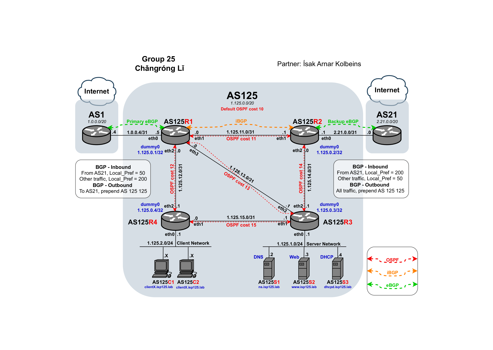

# ISP 实现项目

### 项目概述

该项目涉及使用TCP/IP网络和基于Unix的系统进行互联网服务提供商（ISP）网络的设计、配置和实现。它提供了管理和提供各种网络服务的实践经验，遵循域内和域间的路由协议。

### 目标

- **网络设计:** 开发包含IP地址分配、网络拓扑和服务实现的全面网络设计。
- **路由协议:** 实现和管理域内（OSPF）和域间（BGP）路由协议，以确保高效和冗余的网络路径。
- **服务提供:** 配置DNS、DHCP和Web服务等基本ISP服务。
- **测试和故障排除:** 进行广泛的测试和故障排除，以验证网络设计和服务实现。

### 网络设计

ASN 125的网络设计基于以下组件：

- **网络拓扑:** 详细的网络图，展示各种网络设备及其接口之间的连接。
- **IP地址分配:** 系统地分配IP地址和域名到所有设备接口。

#### 网络图

#### IP地址分配

| 设备 | 接口 | IP地址     | 域名              |
| ---- | ---- | ---------- | ----------------- |
| r1   | eth0 | 1.0.0.5/31 | r1eth0.isp125.lab |
| ...  | ...  | ...        | ...               |

### 路由实现

#### 域内路由

- **协议:** OSPF（开放最短路径优先）
- **理由:** OSPF收敛速度快于RIP，并且可以通过成本差异避免等价路径。
- **设计:** 每个路由器至少连接两个接口以确保冗余。通过分配特定的成本值来避免等价路径。

#### 域间路由

- **协议:** BGP（边界网关协议）
- **配置:** 在AS125R1和AS125R2上实现BGP，AS125R1-AS1为主链路，AS125R2-AS21为备份链路。
- **策略:** 流量主要通过AS125R1-AS1路由，AS125R2-AS21作为备份。使用路由映射和BGP属性来有效地管理路由选择和流量。

### 服务实现

#### DNS

- **域:** ns.isp125.lab
- **功能:** 提供正向查找服务。

#### Web

- **域:** [www.isp125.lab](http://www.isp125.lab)
- **内容:** 托管一个简单的文本网页。

#### DHCP

- **域:** dhcpd.isp125.lab
- **功能:** 动态分配IP地址给客户端设备。

### 测试与验证

进行了广泛的测试以确保网络及其服务的可靠性和性能。这包括：

- **连接测试:** 使用`ping`和`traceroute`验证网络连接。
- **服务验证:** 确保DNS解析、网页访问和动态IP分配。

### 结论

该项目成功展示了设计、实现和管理一个完整功能的ISP网络的能力。它突出了网络设计、路由协议配置和服务提供所需的技术技能，以及故障排除和解决网络问题的能力。

有关此README的英文版本，请参见[README.md](README.md)。